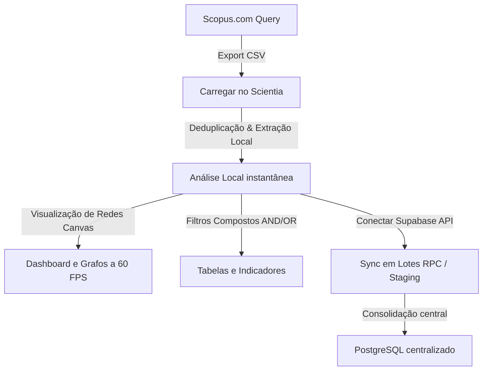

# 🔬 Scientia — Scopus Base Manager (SBM)

[](https://vite.dev/)
[](https://react.dev/)
[](https://zustand-demo.pmnd.rs/)
[](https://tailwindcss.com/)
[](https://supabase.com/)

**Scientia (SBM)** é uma plataforma analítica de alto desempenho construída para o processamento, normalização, auditoria e visualização interativa de bases de dados bibliométricas exportadas da plataforma **Scopus**.

Desenvolvido para pesquisadores e analistas acadêmicos, o Scientia opera 100% no navegador para carregamentos rápidos e análise de redes de coautoria/palavras-chave em tempo de execução, contando também com sincronização paralela otimizada via **Supabase (PostgreSQL)** para persistência persistente em nuvem.

---

## 📸 Demonstração do Fluxo



---

## 🛠️ Tecnologias & Arquitetura

- **React 19 & TypeScript**: Componentização moderna, reatividade focada e forte tipagem estática.
- **Zustand**: Gerenciamento de estado global centralizado, derivando métricas complexas com `rebuildState()`.
- **Tailwind CSS v4 (com CSS Variables)**: Sistema de design fluído, modo escuro (Dark/Light mode) nativo com variáveis OKLCH de alta fidelidade e transições suaves.
- **Canvas Vetorial**: Renderizador de grafos físicos dinâmicos (coautoria e palavras-chave) com simulação de gravidade por molas, otimizado para não disparar renderizações redundantes no React.
- **Supabase JS Client v2**: Paginação do tipo Keyset Seek (`gt('id', last_id)`) com concorrência regulada para transferir massivos volumes de registros sem travar a rede do usuário.

---

## ⚙️ Configuração do Ambiente & Setup

### 1. Contas Necessárias
Para rodar este projeto e persistir dados na nuvem, você precisará de:
1. **Conta no Supabase**: Acesse [Supabase.com](https://supabase.com/) (plano gratuito atende perfeitamente). Crie um projeto PostgreSQL em branco.
2. **Base de dados do Scopus**: Acesso institucional via Portal de Periódicos CAPES ou similar ao portal [Scopus.com](https://www.scopus.com/).

### 2. Preparação do Arquivo `.env`
Crie um arquivo `.env` na raiz do projeto baseado no `.env.example`:

```bash
# Copie o template
cp .env.example .env
```

Edite o arquivo `.env` com as chaves do seu projeto Supabase:
```env
VITE_SUPABASE_URL=https://seu-projeto-id.supabase.co
VITE_SUPABASE_KEY=sua-anon-public-key-jwt-gerada
```

*(Nota: O tempo de execução também permite configurar essas chaves dinamicamente dentro do painel "Nuvem" da própria interface da aplicação, ficando salvas no LocalStorage do navegador).*

### 3. Instalação e Execução Local

```bash
# 1. Instalar as dependências do projeto
npm install

# 2. Executar o servidor de desenvolvimento do Vite (Porta 3000)
npm run dev

# 3. Gerar o pacote de produção minificado
npm run build
```

---

## 🗄️ Estrutura de Banco de Dados (Supabase DDL)

Para estruturar o banco de dados no Supabase, abra o **SQL Editor** no painel administrativo do seu projeto Supabase e execute o script abaixo. Este script cria a estrutura relacional de alta eficiência, os índices de indexação rápidos, a tabela de staging temporária e as procedures em `PL/pgSQL` para inserção em lote.

### Script SQL Principal:

```sql
-- 1. Tabela Central de Artigos
CREATE TABLE IF NOT EXISTS artigo (
    id SERIAL PRIMARY KEY,
    scopus_id TEXT UNIQUE NOT NULL,
    titulo TEXT NOT NULL,
    resumo TEXT,
    ano INTEGER,
    source TEXT,
    cited_by INTEGER DEFAULT 0,
    doi TEXT,
    link TEXT,
    issn TEXT,
    isbn TEXT,
    coden TEXT,
    linguagem TEXT,
    document_type TEXT,
    created_at TIMESTAMP WITH TIME ZONE DEFAULT NOW()
);

-- 2. Tabela de Autores
CREATE TABLE IF NOT EXISTS autor (
    id BIGINT PRIMARY KEY, -- ID numérico do Scopus
    nome TEXT NOT NULL,
    nome_completo TEXT,
    created_at TIMESTAMP WITH TIME ZONE DEFAULT NOW()
);

-- 3. Tabela de Palavras-Chave
CREATE TABLE IF NOT EXISTS palavra_chave (
    id SERIAL PRIMARY KEY,
    palavra TEXT NOT NULL,
    tipo TEXT NOT NULL, -- 'author' ou 'index'
    created_at TIMESTAMP WITH TIME ZONE DEFAULT NOW(),
    CONSTRAINT unique_palavra_tipo UNIQUE (palavra, tipo)
);

-- 4. Tabela de Referências Extraídas
CREATE TABLE IF NOT EXISTS referencia (
    id SERIAL PRIMARY KEY,
    raw_reference TEXT UNIQUE NOT NULL,
    titulo TEXT,
    ano INTEGER,
    doi TEXT,
    created_at TIMESTAMP WITH TIME ZONE DEFAULT NOW()
);

-- 5. Tabela de Tipos de Acesso Aberto (Open Access)
CREATE TABLE IF NOT EXISTS open_access_tipo (
    id SERIAL PRIMARY KEY,
    nome TEXT UNIQUE NOT NULL,
    created_at TIMESTAMP WITH TIME ZONE DEFAULT NOW()
);

-- 6. Tabelas de Relações (N-para-N)
CREATE TABLE IF NOT EXISTS artigo_autor (
    artigo_id INTEGER REFERENCES artigo(id) ON DELETE CASCADE,
    autor_id BIGINT REFERENCES autor(id) ON DELETE CASCADE,
    PRIMARY KEY (artigo_id, autor_id)
);

CREATE TABLE IF NOT EXISTS artigo_palavra_chave (
    artigo_id INTEGER REFERENCES artigo(id) ON DELETE CASCADE,
    palavra_chave_id INTEGER REFERENCES palavra_chave(id) ON DELETE CASCADE,
    PRIMARY KEY (artigo_id, palavra_chave_id)
);

CREATE TABLE IF NOT EXISTS artigo_referencia (
    artigo_id INTEGER REFERENCES artigo(id) ON DELETE CASCADE,
    referencia_id INTEGER REFERENCES referencia(id) ON DELETE CASCADE,
    PRIMARY KEY (artigo_id, referencia_id)
);

CREATE TABLE IF NOT EXISTS artigo_open_access (
    artigo_id INTEGER REFERENCES artigo(id) ON DELETE CASCADE,
    open_access_id INTEGER REFERENCES open_access_tipo(id) ON DELETE CASCADE,
    PRIMARY KEY (artigo_id, open_access_id)
);

-- 7. Tabela de Staging para payloads densos (Fallback / Upload assíncrono)
CREATE TABLE IF NOT EXISTS staging_import (
    id SERIAL PRIMARY KEY,
    session_id TEXT NOT NULL,
    payload JSONB NOT NULL,
    created_at TIMESTAMP WITH TIME ZONE DEFAULT NOW()
);

-- 8. Tabela Simples Legada (Fallback Simples)
CREATE TABLE IF NOT EXISTS scopus_articles (
    id SERIAL PRIMARY KEY,
    scopus_id TEXT UNIQUE,
    title TEXT,
    year INTEGER,
    journal TEXT,
    cited_by INTEGER,
    doi TEXT,
    abstract TEXT,
    authors_data JSONB,
    open_access TEXT,
    created_at TIMESTAMP WITH TIME ZONE DEFAULT NOW()
);

-- =========================================================================
-- 9. Índices para Otimização de Consultas de Busca e Relacionamentos
-- =========================================================================
CREATE INDEX IF NOT EXISTS idx_artigo_scopus_id ON artigo(scopus_id);
CREATE INDEX IF NOT EXISTS idx_artigo_ano ON artigo(ano);
CREATE INDEX IF NOT EXISTS idx_palavra_chave_palavra ON palavra_chave(palavra);
CREATE INDEX IF NOT EXISTS idx_referencia_raw_reference ON referencia(raw_reference);
CREATE INDEX IF NOT EXISTS idx_staging_session_id ON staging_import(session_id);

-- =========================================================================
-- 10. View Completa Desmembrada (vw_artigos_completos)
-- Usada pela aplicação para carregar o payload relacional de forma ultra rápida
-- =========================================================================
CREATE OR REPLACE VIEW vw_artigos_completos AS
SELECT 
    a.id,
    a.scopus_id,
    a.titulo,
    a.ano,
    a.source,
    a.cited_by,
    a.doi,
    a.link,
    a.resumo,
    a.issn,
    a.isbn,
    a.coden,
    a.linguagem,
    a.document_type,
    COALESCE(
        (
            SELECT array_agg(COALESCE(au.id::text, '') || '::' || COALESCE(au.nome, '') || '::' || COALESCE(au.nome_completo, ''))
            FROM artigo_autor aa
            JOIN autor au ON aa.autor_id = au.id
            WHERE aa.artigo_id = a.id
        ), 
        ARRAY[]::text[]
    ) AS autores,
    COALESCE(
        (
            SELECT array_agg(pc.palavra)
            FROM artigo_palavra_chave apc
            JOIN palavra_chave pc ON apc.palavra_chave_id = pc.id
            WHERE apc.artigo_id = a.id
        ),
        ARRAY[]::text[]
    ) AS palavras_chave,
    COALESCE(
        (
            SELECT array_agg(oa.nome)
            FROM artigo_open_access aoa
            JOIN open_access_tipo oa ON aoa.open_access_id = oa.id
            WHERE aoa.artigo_id = a.id
        ),
        ARRAY[]::text[]
    ) AS open_access_tipos
FROM artigo a;

-- =========================================================================
-- 11. Procedures PL/pgSQL para Processamento de Lotes (RPC)
-- =========================================================================

-- Função process_chunk: Realiza upserts de payloads relacionais parciais com mapeamentos temporários
CREATE OR REPLACE FUNCTION process_chunk(p_payload jsonb)
RETURNS void AS $$
DECLARE
    v_artigo jsonb;
    v_autor jsonb;
    v_kw jsonb;
    v_ref jsonb;
    v_oa jsonb;
    v_rel jsonb;
    v_artigo_id integer;
    v_kw_id integer;
    v_ref_id integer;
    v_oa_id integer;
BEGIN
    -- Tabelas temporárias para mapear IDs parciais gerados na requisição
    CREATE TEMP TABLE IF NOT EXISTS temp_kw_map (temp_id integer, real_id integer) ON COMMIT DROP;
    CREATE TEMP TABLE IF NOT EXISTS temp_ref_map (temp_id integer, real_id integer) ON COMMIT DROP;
    CREATE TEMP TABLE IF NOT EXISTS temp_oa_map (temp_id integer, real_id integer) ON COMMIT DROP;
    
    TRUNCATE TABLE temp_kw_map;
    TRUNCATE TABLE temp_ref_map;
    TRUNCATE TABLE temp_oa_map;

    -- A. Inserir/Atualizar Artigos
    FOR v_artigo IN SELECT * FROM jsonb_to_recordset(p_payload->'artigo') 
        AS (scopus_id text, titulo text, resumo text, ano integer, source text, cited_by integer, doi text, link text, issn text, isbn text, coden text, linguagem text, document_type text) 
    LOOP
        INSERT INTO artigo (scopus_id, titulo, resumo, ano, source, cited_by, doi, link, issn, isbn, coden, linguagem, document_type)
        VALUES (v_artigo.scopus_id, v_artigo.titulo, v_artigo.resumo, v_artigo.ano, v_artigo.source, v_artigo.cited_by, v_artigo.doi, v_artigo.link, v_artigo.issn, v_artigo.isbn, v_artigo.coden, v_artigo.linguagem, v_artigo.document_type)
        ON CONFLICT (scopus_id) DO UPDATE SET
            titulo = EXCLUDED.titulo,
            resumo = EXCLUDED.resumo,
            ano = EXCLUDED.ano,
            source = EXCLUDED.source,
            cited_by = EXCLUDED.cited_by,
            doi = EXCLUDED.doi,
            link = EXCLUDED.link,
            issn = EXCLUDED.issn,
            isbn = EXCLUDED.isbn,
            coden = EXCLUDED.coden,
            linguagem = EXCLUDED.linguagem,
            document_type = EXCLUDED.document_type;
    END LOOP;

    -- B. Inserir/Atualizar Autores
    FOR v_autor IN SELECT * FROM jsonb_to_recordset(p_payload->'autor') AS (id bigint, nome text, nome_completo text) LOOP
        INSERT INTO autor (id, nome, nome_completo)
        VALUES (v_autor.id, v_autor.nome, v_autor.nome_completo)
        ON CONFLICT (id) DO UPDATE SET
            nome = EXCLUDED.nome,
            nome_completo = EXCLUDED.nome_completo;
    END LOOP;

    -- C. Inserir Palavras-Chave & Mapear IDs
    FOR v_kw IN SELECT * FROM jsonb_to_recordset(p_payload->'palavra_chave') AS (temp_id integer, palavra text, tipo text) LOOP
        INSERT INTO palavra_chave (palavra, tipo)
        VALUES (v_kw.palavra, v_kw.tipo)
        ON CONFLICT (palavra, tipo) DO UPDATE SET palavra = EXCLUDED.palavra
        RETURNING id INTO v_kw_id;
        
        INSERT INTO temp_kw_map (temp_id, real_id) VALUES (v_kw.temp_id, v_kw_id);
    END LOOP;

    -- D. Inserir Referências & Mapear IDs
    FOR v_ref IN SELECT * FROM jsonb_to_recordset(p_payload->'referencia') AS (temp_id integer, raw_reference text, titulo text, ano integer, doi text) LOOP
        INSERT INTO referencia (raw_reference, titulo, ano, doi)
        VALUES (v_ref.raw_reference, v_ref.titulo, v_ref.ano, v_ref.doi)
        ON CONFLICT (raw_reference) DO UPDATE SET 
            titulo = EXCLUDED.titulo,
            ano = EXCLUDED.ano,
            doi = EXCLUDED.doi
        RETURNING id INTO v_ref_id;
        
        INSERT INTO temp_ref_map (temp_id, real_id) VALUES (v_ref.temp_id, v_ref_id);
    END LOOP;

    -- E. Inserir Tipos de Acesso & Mapear IDs
    FOR v_oa IN SELECT * FROM jsonb_to_recordset(p_payload->'open_access_tipo') AS (temp_id integer, nome text) LOOP
        INSERT INTO open_access_tipo (nome)
        VALUES (v_oa.nome)
        ON CONFLICT (nome) DO UPDATE SET nome = EXCLUDED.nome
        RETURNING id INTO v_oa_id;
        
        INSERT INTO temp_oa_map (temp_id, real_id) VALUES (v_oa.temp_id, v_oa_id);
    END LOOP;

    -- F. Inserir Relações N-para-N
    -- Artigo <-> Autor
    FOR v_rel IN SELECT * FROM jsonb_to_recordset(p_payload->'artigo_autor') AS (temp_scopus_id text, autor_id bigint) LOOP
        SELECT id INTO v_artigo_id FROM artigo WHERE scopus_id = v_rel.temp_scopus_id;
        IF v_artigo_id IS NOT NULL THEN
            INSERT INTO artigo_autor (artigo_id, autor_id)
            VALUES (v_artigo_id, v_rel.autor_id)
            ON CONFLICT (artigo_id, autor_id) DO NOTHING;
        END IF;
    END LOOP;

    -- Artigo <-> Palavra-Chave
    FOR v_rel IN SELECT * FROM jsonb_to_recordset(p_payload->'artigo_palavra_chave') AS (temp_scopus_id text, temp_kw_id integer) LOOP
        SELECT id INTO v_artigo_id FROM artigo WHERE scopus_id = v_rel.temp_scopus_id;
        SELECT real_id INTO v_kw_id FROM temp_kw_map WHERE temp_id = v_rel.temp_kw_id;
        IF v_artigo_id IS NOT NULL AND v_kw_id IS NOT NULL THEN
            INSERT INTO artigo_palavra_chave (artigo_id, palavra_chave_id)
            VALUES (v_artigo_id, v_kw_id)
            ON CONFLICT (artigo_id, palavra_chave_id) DO NOTHING;
        END IF;
    END LOOP;

    -- Artigo <-> Referência
    FOR v_rel IN SELECT * FROM jsonb_to_recordset(p_payload->'artigo_referencia') AS (temp_scopus_id text, temp_ref_id integer) LOOP
        SELECT id INTO v_artigo_id FROM artigo WHERE scopus_id = v_rel.temp_scopus_id;
        SELECT real_id INTO v_ref_id FROM temp_ref_map WHERE temp_id = v_rel.temp_ref_id;
        IF v_artigo_id IS NOT NULL AND v_ref_id IS NOT NULL THEN
            INSERT INTO artigo_referencia (artigo_id, referencia_id)
            VALUES (v_artigo_id, v_ref_id)
            ON CONFLICT (artigo_id, referencia_id) DO NOTHING;
        END IF;
    END LOOP;

    -- Artigo <-> Open Access
    FOR v_rel IN SELECT * FROM jsonb_to_recordset(p_payload->'artigo_open_access') AS (temp_scopus_id text, temp_oa_id integer) LOOP
        SELECT id INTO v_artigo_id FROM artigo WHERE scopus_id = v_rel.temp_scopus_id;
        SELECT real_id INTO v_oa_id FROM temp_oa_map WHERE temp_id = v_rel.temp_oa_id;
        IF v_artigo_id IS NOT NULL AND v_oa_id IS NOT NULL THEN
            INSERT INTO artigo_open_access (artigo_id, open_access_id)
            VALUES (v_artigo_id, v_oa_id)
            ON CONFLICT (artigo_id, open_access_id) DO NOTHING;
        END IF;
    END LOOP;
END;
$$ LANGUAGE plpgsql;

-- Função process_staging_data: Consolida chunks carregados na tabela staging_import
CREATE OR REPLACE FUNCTION process_staging_data(p_session_id text)
RETURNS void AS $$
DECLARE
    v_rec record;
BEGIN
    FOR v_rec IN SELECT payload FROM staging_import WHERE session_id = p_session_id LOOP
        PERFORM process_chunk(v_rec.payload);
    END LOOP;
    DELETE FROM staging_import WHERE session_id = p_session_id;
END;
$$ LANGUAGE plpgsql;
```

---

## 📈 Instruções para Exportar Base de Dados do Scopus

Para garantir que o parser extraia autores, DOIs, palavras-chave e acoplamento de referências bibliográficas com sucesso, exporte o CSV seguindo este protocolo:

1. Acesse [Scopus.com](https://www.scopus.com/) e execute a sua query científica.
2. Na página de resultados, selecione os artigos desejados.
3. Clique no menu de **Exportação (Export)** e selecione a extensão **CSV**.
4. No painel de metadados, **selecione obrigatoriamente** as seguintes caixas:
   - **Citation information** (Autores, ID do autor, Título do documento, Ano, Título da fonte, Contagem de citações, DOI).
   - **Bibliographical information** (ISSN, Idioma do documento original, Tipo de documento, CODEN).
   - **Abstract & keywords** (Resumo, Palavras-chave do autor, Palavras-chave indexadas).
   - **Other information** (Marque **Include References / Incluir Referências**).
5. Exporte e salve o arquivo para carregar na ferramenta.

---

## 🔍 Mecanismo de Filtros Compostos (Multi-Filtro)

O Scientia conta com um sistema de filtragem unificado e acumulativo (Lógica Relacional AND-entre-tipos e OR-no-mesmo-tipo):

- **Como funciona**: Ao clicar em um Autor, uma Keyword e um Ano no Dashboard ou nas tabelas, o banner superior exibirá pills identificadas por cores para cada critério ativo.
- **AND entre tipos**: Selecionar o autor `Silva, A.` e a palavra-chave `Agrofloresta` retornará apenas os artigos que contiverem **ambos** os parâmetros.
- **OR no mesmo tipo**: Clicar nos autores `Silva, A.` e `Santos, B.` retornará artigos escritos por Silva **ou** Santos, e que também atendam aos filtros de outras categorias.
- **Visualização Reativa**: A nuvem de palavras-chave, o mapa de rede e os KPIs numéricos adaptam-se imediatamente a cada pill adicionada ou removida.

---

## 📂 Organização do Projeto

```
Artigos_Florestais/
├── src/
│   ├── types.ts              # Modelagem de dados e interfaces
│   ├── main.tsx              # Ponto de entrada React + DOM render
│   ├── App.tsx               # Orquestrador da shell da aplicação
│   ├── index.css             # Tema, variáveis OKLCH e classes utilitárias
│   ├── components/
│   │   ├── Header.tsx        # Topbar com actions e troca de tema claro/escuro
│   │   ├── FilterBanner.tsx  # Banner superior para gerenciamento de pills
│   │   ├── KpiGrid.tsx       # Grid com 6 painéis de estatísticas bibliométricas
│   │   ├── DetailDrawer.tsx  # Drawer lateral para inspeção de resumos e referências
│   │   ├── NetworkCanvas.tsx # Visualizador vetorial de relacionamentos bibliométricos
│   │   ├── WordCloud.tsx     # Canvas interativo de palavras-chave com toggle pills
│   │   └── tabs/             # Abas principais de navegação (Dashboard, Artigos, Autores, etc)
│   ├── store/
│   │   └── useAppStore.ts    # Central Zustand de persistência e estados globais
│   └── utils/
│       ├── parser.ts         # Parser resiliente para arquivos CSV Scopus
│       └── filter.ts         # Algoritmo de filtragem cruzada acumulativa
├── index.html                # Documento HTML raiz
├── package.json              # Manifesto de dependências e scripts do projeto
├── tsconfig.json             # Configurações do compilador TypeScript
└── vite.config.ts            # Arquivo de build do Vite
```
